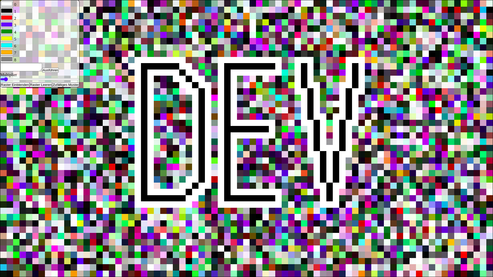
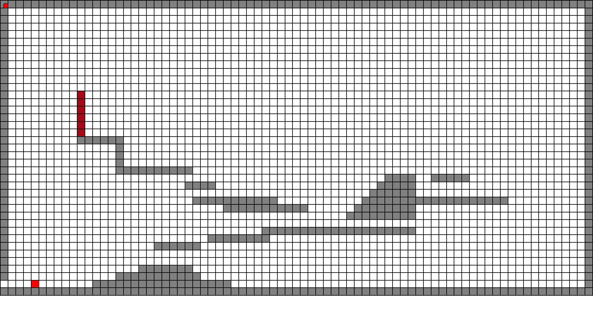
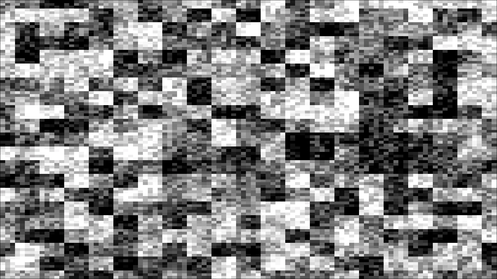

# Full-Page-Pixel
a few weeks ago I wanted to Draw things like on a Canvas(-tag) but I don't want to learn the whole canvas and ctx things so I made my own!

What You **CAN**:
- Use the Menu to change your color palat
- Press `ALT+[Number Key]` to change the current Color
- change The Multiplier to get More or less Pixels
- Click on...
  - `Raster Ausblenden` to change the Visibility of the grid
  - `Raster Leeren` to clear the Canvas
  - `Zufäliges Muster` to give each Pixel a Random Color
- Press `ALT+F` to toggle `Filling Mode` where you selcet to Points and the inbetween gets filled with your curret color
- Use the function...
  - `replay()` to *replay* your progress
  - `findPixels(color)` to find all Pixels with this specific color
  - `unFound()` to remove the markings
  - `exportCanvas()` to... you guessed It... **EXPORT THE CANVAS**
  - `ìmportCanvas(data)` to well, import a Canvas
  - `toggleMenu()` to OMG, toggle the Menu
  - `drawJSON(array,width,heihgt)` to draw Pictures with JSON Array
  ```JSON
  [
    [
      'black','black','black'
    ],
    [
      'white','black','white'
    ],
    [
      'white','black','white'
    ],
  ]
  ```
  A Not that Good Drawing:
  
  A Simple jump and run game:
  
  A noise Algorithme:
  

  Maby I change the Language from German English to English... but I'm not sure right now.
